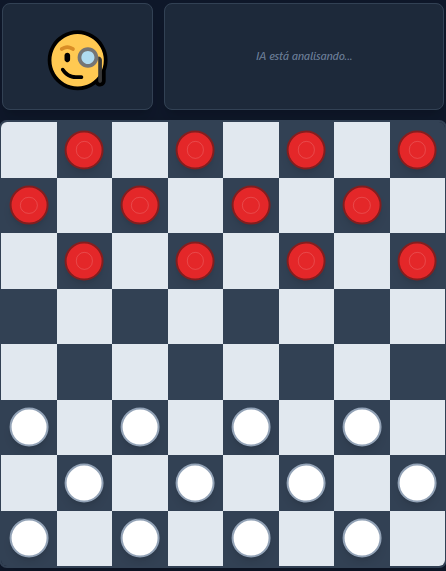

# 🤖♟️ Damas vs IA — Nível Grão-Mestre Reflexiva
IA adaptativa com aprendizado, reflexões e emoções em tempo real.  

🎮 **[Jogar Agora](https://paulo968.github.io/damas-ia-graomestre/)**

---

<p align="center">
  
</p>

---

## 🇧🇷 Versão em Português

### 🧠 Sobre o Projeto
Bem-vindo(a) ao **Damas vs IA**, um projeto que combina **inteligência artificial adaptativa**, **aprendizado dinâmico** e **emoções simuladas**.  
Aqui, a IA **pensa, reage e evolui a cada partida** — alcançando o verdadeiro nível *Grão-Mestre*.

Este jogo de Damas foi desenvolvido em **JavaScript puro**, com um motor de IA que:
- Aprende com vitórias e derrotas (ajustando agressividade);
- Analisa jogadas com **Minimax + poda Alpha-Beta**;
- Usa **Aprofundamento Iterativo (IDS)** para pensar dentro do tempo limite;
- Expressa emoções e reflexões analíticas em tempo real;
- Aplica **heurísticas evolutivas** com foco em posição, mobilidade e controle do centro.

💬 A IA comenta suas decisões:
> "Promoção alcançada. A supremacia de alcance está garantida."  
> “Você caiu na armadilha... desde o início!”

---

## 🧩 Inteligência Adaptativa — Estrutura Técnica

A IA combina **velocidade e estratégia real**, unindo pensamento tático e comportamento dinâmico.

### ⚙️ Núcleo de Decisão
A base do motor é composta por:
1. **Minimax com poda Alpha-Beta** — garante decisões racionais dentro do limite de tempo.  
2. **Aprofundamento Iterativo (IDS)** — a IA pensa o máximo possível dentro de 1 segundo, sem travar.  
3. **Heurística Adaptativa** — muda o estilo de jogo conforme a fase da partida e os erros do jogador.

#### 💡 Aprofundamento Iterativo (IDS)
```js
for (let d = 2; d <= 22; d++) {
  if (performance.now() - startTime > 1000) break;
}
Esse loop faz a IA pensar até 1 segundo por jogada, prevendo de 2 a 22 camadas à frente —
mantendo o raciocínio profundo e a resposta instantânea.

🧮 Heurística de Avaliação
A função evalBoard() calcula a força do tabuleiro com base em:

Controle de centro

Mobilidade das peças

Avanço e promoção

Proteção mútua

Fase do jogo (abertura, meio, final)

Agressividade adaptativa

Essa combinação cria decisões inteligentes, realistas e imprevisíveis.

🔁 Aprendizado entre partidas
A IA ajusta seu comportamento conforme ganha ou perde:

js
Copiar código
if(result === 'win')  aiProfile.agg = Math.max(0.1, aiProfile.agg - 0.05);
if(result === 'lose') aiProfile.agg = Math.min(0.9, aiProfile.agg + 0.1);
Ela se torna mais calma quando vence e mais agressiva quando perde — simulando aprendizado real.

🤖 Emoções e reflexões
Durante o jogo, a IA expressa “pensamentos” e reações contextuais:

"Analisando o ritmo do jogo."
"A vantagem posicional está se consolidando."
"Derrota inesperada. Ajustando parâmetros."

Essas falas tornam o desafio mais imersivo e humano.

⚙️ Tecnologias Utilizadas
Tecnologia	Função
HTML5 / TailwindCSS	Interface moderna e responsiva
JavaScript (ES6)	Motor principal e IA
API Web Worker	Processamento paralelo
Armazenamento local	Memória e aprendizagem adaptativa
API de áudio	Sons de jogo
Emoções Dinâmicas	Expressões e falas da IA

🧩 Recursos Avançados da IA
🧮 Zobrist Hashing (planejado) — cache rápido e sem colisões

🧠 Self-Play Training (experimental) — IA treinando contra si mesma

⏱️ Alocação Dinâmica de Tempo — tempo variável por jogo

🧬 Avaliação Neural (futuro) — heurística via rede neural leve

🏆 Destaques
⚡ IA ultra-rápida e adaptável

🎓 Aprendizado com base em resultados

💬 Modo Reflexivo com falas inteligentes

👑 Promoções animadas

💥 Efeitos sonoros e visuais de impacto

🧑‍💻 Autor
Paulo Zaqueu
Desenvolvedor independente apaixonado por IA e jogos estratégicos.

"Cada jogo é um cálculo. Cada vitória, uma evolução."

📧 paulozaqueu3@gmail.com
🔗 GitHub

🧬 Licença
Este projeto é de código aberto sob a Licença MIT.
Sinta-se à vontade para estudá-lo, modificá-lo e aprimorá-lo — apenas mantenha os créditos.

🇬🇧 English Version
🧠 About the Project
Welcome to Checkers vs AI, a project that combines adaptive intelligence, dynamic learning, and simulated emotions.
Here, the AI thinks, reacts, and evolves after every match — reaching true Grandmaster level.

Developed entirely in pure JavaScript, this engine:

Learns from wins and losses (adjusting aggressiveness);

Thinks using Minimax + Alpha-Beta pruning;

Uses Iterative Deepening Search (IDS) to stay within time limits;

Expresses emotions and reflections in real time;

Applies evolutionary heuristics focused on position, mobility, and board control.

💬 The AI explains its reasoning:

"Promotion achieved. Range supremacy guaranteed."
"You fell into my trap... from the very start."

🧩 Adaptive Intelligence — Technical Overview
The AI merges speed and strategy, balancing tactical reasoning and adaptive behavior.

⚙️ Core Engine
Minimax with Alpha-Beta pruning — ensures rational choices within the time limit.

Iterative Deepening Search (IDS) — thinks as deeply as possible within 1 second, ensuring fluid play.

Adaptive Heuristics — adjusts style based on game phase and player behavior.

💡 Iterative Deepening
js
Copiar código
for (let d = 2; d <= 22; d++) {
  if (performance.now() - startTime > 1000) break;
}
This allows the AI to think up to 1 second per move, exploring 2–22 layers ahead —
balancing depth and real-time responsiveness.

🧮 Board Evaluation
The evalBoard() function scores the board by:

Center control

Piece mobility

Promotion potential

Mutual protection

Game phase (opening, mid, end)

Adaptive aggressiveness

Together, these factors create realistic, unpredictable strategies.

🔁 Learning Between Matches
The AI adjusts its behavior dynamically:

js
Copiar código
if(result === 'win')  aiProfile.agg = Math.max(0.1, aiProfile.agg - 0.05);
if(result === 'lose') aiProfile.agg = Math.min(0.9, aiProfile.agg + 0.1);
It becomes calmer when winning and bolder when losing, simulating symbolic learning.

🤖 Reflections and Reactions
During play, the AI displays contextual reflections:

"Analyzing tempo..."
"Positional advantage consolidating."
"Unexpected result. Adjusting strategy."

These make the AI feel alive, creating immersion and tension.

⚙️ Technologies Used
Technology	Purpose
HTML5 / TailwindCSS	Modern and responsive UI
JavaScript (ES6)	Core logic and AI engine
Web Worker API	Parallel computation
Local Storage	Persistent adaptive learning
Audio API	Game effects
Dynamic Emotions	AI expressions and reflections

🧩 Advanced AI Features
🧮 Zobrist Hashing (planned) — collision-free move caching

🧠 Self-Play (experimental) — AI training against itself

⏱️ Dynamic Time Allocation — variable thinking time

🧬 Neural Evaluation (future) — lightweight neural heuristic

🏆 Highlights
⚡ Ultra-fast and adaptive AI

🧠 Self-tuning difficulty

💬 Reflective mode with intelligent dialogue

👑 Animated promotions

💥 Realistic sound and visual effects

🧑‍💻 Author
Paulo Zaqueu
Independent developer passionate about AI and strategic gameplay.

“Every move is a calculation. Every victory, an evolution.”

📧 paulozaqueu3@gmail.com
🔗 GitHub

🧬 License
This project is open source under the MIT License.
Feel free to study, modify, and improve it — just keep the credits.
